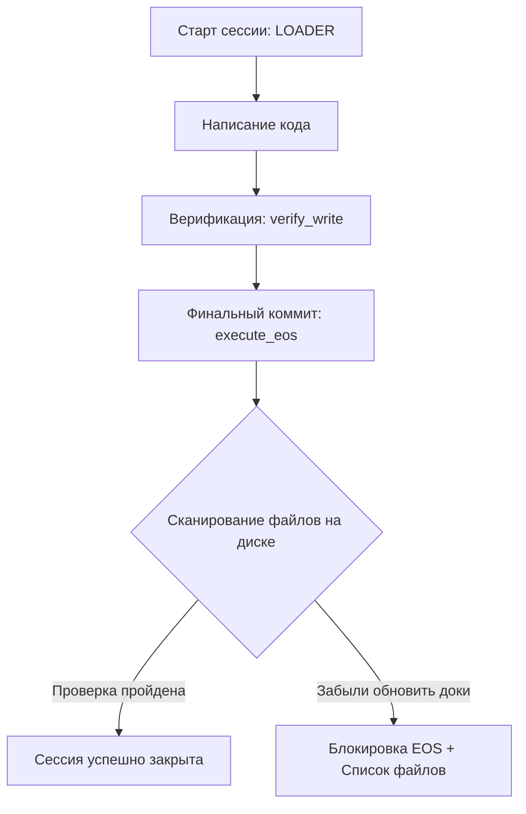

# Enterprise-Grade Documentation and Project Tracking Standards

Этот отчет содержит анализ стандартов ведения документации и управления задачами, принятых в ведущих технологических компаниях (Google, Stripe, Spotify, Amazon), и способы их интеграции в проектную память нашего MCP-сервера.

---

## 1. Мировые стандарты ведения документации

В крупных корпорациях документация делится на 4 основных типа (модель Diátaxis):
1. **Tutorials (Обучение)** — как сделать первые шаги.
2. **How-To Guides (Инструкции)** — решение конкретных задач (наш `procedures.md`).
3. **Reference (Справочник)** — описание API, архитектуры (наш `architecture_map.md`).
4. **Explanation (Понимание)** — контекст, причины решений (наши решения `decisions.md` и спецификации).

В enterprise-архитектуре критически важны два формата:

### A. ADR (Architecture Decision Records) — Записи архитектурных решений
Внедрены компанией **Spotify** и используются повсеместно. Каждый раз, когда принимается важное техническое решение (например, разделение CSS по файлам или выбор структуры), создается мини-документ (ADR) по жесткому шаблону:
* **Title (Название):** Кратко и понятно.
* **Status (Статус):** Proposed (Предложено) / Accepted (Принято) / Rejected (Отклонено) / Superseded (Устарело).
* **Context (Контекст):** Какую проблему решаем, какие есть ограничения.
* **Decision (Решение):** Какая технология/подход выбраны и почему.
* **Consequences (Последствия):** Что мы выигрываем и чем жертвуем (технический долг, новые зависимости).

### B. RFC (Request for Comments) / Design Docs — Проектирование перед кодом
Используется в **Google, Meta, Stripe**. Написание кода запрещено без предварительного составления Design Doc.
* Помогает избежать переписывания кода (scope creep) и сразу выявляет проблемы безопасности, производительности и совместимости.
* В нашем случае — это связка `project_launch_plan.md` и `specifications/`.

---

## 2. Integration of Standards into AI_MEMORY

Чтобы наш агент вел документацию на корпоративном уровне, мы должны расширить шаблоны и автоматизировать проверки:

### Шаг 1. Framework Presets (Выбор стека при инициализации)
Добавляем поддержку параметров `preset` в `init_project_memory`:
* **`vanilla`**: Простой HTML/CSS/JS (папки `css/`, `js/`).
* **`react`**: Современная структура (`src/components/`, `src/styles/`, `src/hooks/`).
* **`nextjs`**: Структура App Router (`src/app/`, `src/components/`).

### Шаг 2. Автоматическая верификация изменений на выходе (QA Scan)
Внедряем умный и быстрый сканер в метод `execute_eos`:
1. Сервер запоминает файлы, которые были изменены на диске с момента вызова `execute_loader` (игнорируя тяжелые директории: `.git`, `node_modules`, `dist`, `build`, `.next`).
2. Сервер сравнивает этот список файлов со списком в `session_log.md` (раздел `Files changed`).
3. Если агент изменил файлы кода, но **забыл указать их в логе сессии**, `execute_eos` возвращает ошибку `EOS_BLOCKED` с требованием синхронизировать документацию.

### Шаг 3. Защита от потери контекста в задачах (Tasks Backlog)
При вызове `execute_eos` проверяется файл `tasks.md`:
* Если у нас остались задачи в статусе `in_progress`, но агент не описал для них `NEXT_STEP` или `BLOCKERS` в блоке `ACTIVE TASKS`, сессия блокируется. Это гарантирует, что следующий агент продолжит работу ровно с того места, где остановился предыдущий.

### Шаг 4. Ротация логов (Log Rotation)
Для предотвращения разрастания логов на диске:
* Хранятся строго 2 файла: `mcp_history.log` (активный) и `mcp_history.1.log` (предыдущий).
* При достижении размера 50 КБ активный лог перезаписывает резервный, а новый начинает заполняться с чистого листа.
